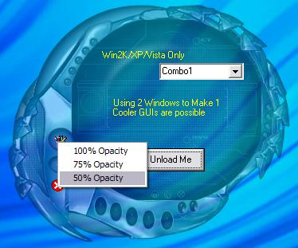



## FYI: Alphablending Forms using ULW

### Description

Win2K &amp; above only. A simple example of using updatelayeredwindow (ULW) and setlayeredwindowattributes (SLWA) APIs to create a semi-transparent form capable of "hosting" controls. The word "hosting" is not correct. This example shows one way of creating a host form for controls and overlaying it on the semitransparent background. Kinda neat. I will be expanding this off and on as I go along. This is NOT a fully functional project, a demo for proof of concept only.
 
### More Info
 

             |
---                |---
**Submitted On**   |2007-05-05 21:10:32
**By**             |[LaVolpe](https://github.com/Planet-Source-Code/PSCIndex/blob/master/ByAuthor/lavolpe.md)
**Level**          |Intermediate
**User Rating**    |4.9 (79 globes from 16 users)
**Compatibility**  |VB 6\.0
**Category**       |[Graphics](https://github.com/Planet-Source-Code/PSCIndex/blob/master/ByCategory/graphics__1-46.md)
**World**          |[Visual Basic](https://github.com/Planet-Source-Code/PSCIndex/blob/master/ByWorld/visual-basic.md)
**Archive File**   |[FYI\_\_Alpha206425562007\.zip](https://github.com/Planet-Source-Code/lavolpe-fyi-alphablending-forms-using-ulw__1-68527/archive/master.zip)

